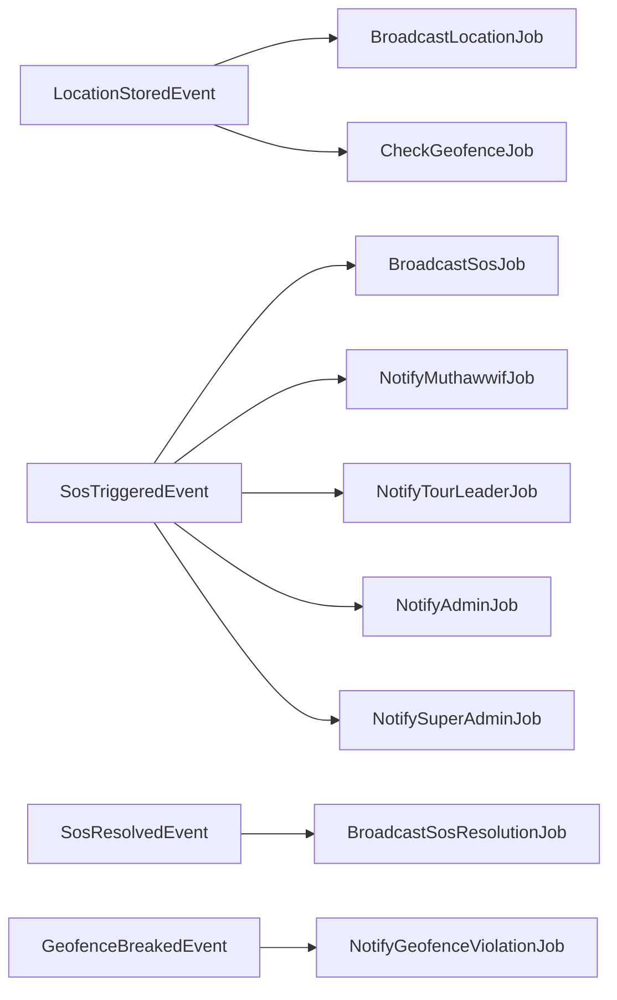
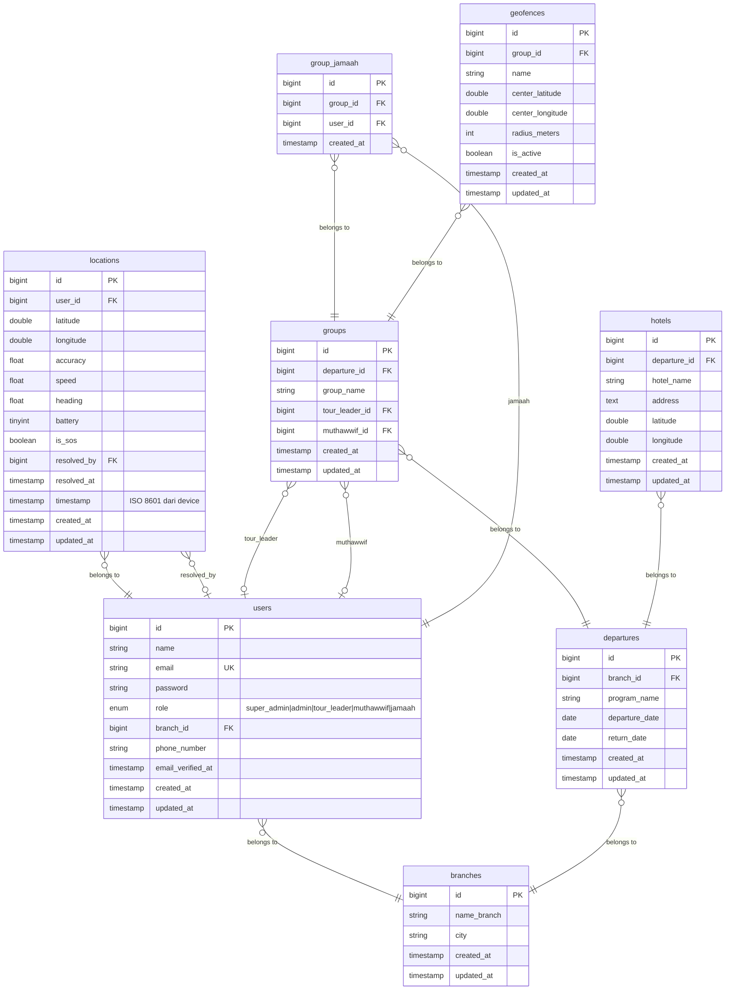

# Design Document: Sistem Manajemen User & Role

## Overview

Sistem Manajemen User & Role adalah pondasi arsitektur dari aplikasi travel umroh berbasis Laravel 11 ini.
Sistem ini mengelola identitas, autentikasi, otorisasi, dan seluruh alur operasional perjalanan umroh —
mulai dari manajemen cabang dan akun pengguna, pelacakan GPS real-time, penanganan SOS darurat,
hingga pemantauan geofence dan integrasi dengan aplikasi Flutter mobile.

Sistem dirancang dengan lima lapisan utama: **Controller → Service → Repository → Model → Database**,
mengikuti standar arsitektur modular Laravel yang memisahkan concerns secara ketat. Setiap domain
fungsional (Auth, User, Branch, Location, SOS, Group, Hotel, Geofence) memiliki Service dan Repository
masing-masing, memastikan testabilitas dan maintainability tinggi.

Lima role pengguna — `super_admin`, `admin`, `tour_leader`, `muthawwif`, `jamaah` — memiliki
cakupan data dan izin aksi yang berbeda, diimplementasikan melalui kombinasi Laravel Sanctum (autentikasi),
Laravel Policy (otorisasi per resource), dan Branch Scoping Middleware (isolasi data per cabang).


## Architecture

### Pola Arsitektur: Layered Architecture + Event-Driven

Sistem menggunakan pola **Layered Architecture** dengan lapisan berikut:

```
HTTP Request
    │
    ▼
┌─────────────────────────────────────┐
│     Middleware Layer                │
│  (Sanctum Auth, RoleCheck, Branch) │
└─────────────────────────────────────┘
    │
    ▼
┌─────────────────────────────────────┐
│       Controller Layer              │
│  (thin — only orchestrates calls)  │
└─────────────────────────────────────┘
    │
    ▼
┌─────────────────────────────────────┐
│       Service Layer                 │
│  (business logic, Policy checks)   │
└─────────────────────────────────────┘
    │                │
    ▼                ▼
┌──────────┐   ┌─────────────────────┐
│Repository│   │  Event / Listener   │
│  Layer   │   │  (async side-effects│
│(DB query)│   │   via Queue)        │
└──────────┘   └─────────────────────┘
    │                │
    ▼                ▼
┌──────────┐   ┌─────────────────────┐
│ Eloquent │   │ Broadcasting        │
│  Models  │   │ (Reverb/Pusher)     │
└──────────┘   └─────────────────────┘
    │
    ▼
┌──────────┐
│ Database │
│(MySQL/   │
│ SQLite)  │
└──────────┘
```


### Diagram Alur Data Utama

```mermaid
flowchart TD
    Flutter["Flutter App\n(Jamaah)"] -->|POST /api/location| LT[LocationTracker API]
    Flutter -->|POST /api/sos| SOS[SOSHandler API]
    Browser["Web Browser\n(Admin/SuperAdmin)"] -->|GET /api/map| MC[MapController]
    Browser -->|WebSocket| WS[Laravel Broadcasting\nReverb/Pusher]

    LT --> LocRepo[LocationRepository]
    LocRepo --> LocModel[Location Model]
    LocModel --> DB[(Database)]
    LocRepo --> LocObserver[LocationObserver]
    LocObserver --> GeoEvent[GeofenceCheckEvent]
    LocObserver --> BroadcastEvent[LocationUpdatedEvent]
    BroadcastEvent --> Queue[Laravel Queue]
    Queue --> Broadcast[WebSocket Channel\nbranch.{branch_id}]
    Broadcast --> WS

    SOS --> SOSService[SOSService]
    SOSService --> LocRepo
    SOSService --> SOSEvent[SOSTriggeredEvent]
    SOSEvent --> Queue
    Queue --> NotifDispatcher[NotificationDispatcher\n- Muthawwif\n- Tour Leader\n- Admin Cabang\n- Super Admin]
    Queue --> Broadcast

    MC -->|scopedByRole| MapService[MapService]
    MapService --> UserRepo[UserRepository]
    MapService --> LocRepo
```


### Keputusan Arsitektur Kunci

**1. Controller adalah Orchestrator Tipis**
Controller tidak boleh berisi logika bisnis atau query database langsung. Controller hanya:
- Menerima request, memanggil FormRequest untuk validasi
- Memanggil satu method pada Service yang sesuai
- Mengembalikan respons JSON/view

Rasional: Memungkinkan unit test pada Service tanpa HTTP overhead.

**2. Branch Scoping via Middleware + Repository**
Branch scoping tidak dilakukan di Controller. `BranchScopeMiddleware` menyuntikkan `branch_id` ke request context. Semua Repository method menerima opsi scope ini secara otomatis untuk role `admin`.

Rasional: Menghindari lupa menambahkan filter di setiap endpoint baru.

**3. Event-Driven Side Effects**
Saat GPS disimpan, side effect (broadcast WebSocket, cek geofence, kirim notifikasi SOS) tidak dipanggil langsung dari Service. Semuanya dikirim ke Queue melalui Events dan Listeners.

Rasional: Menjaga response time API GPS < 500ms, menghindari timeout akibat operasi downstream yang lambat.

**4. Policy-Based Authorization**
Setiap aksi CRUD pada setiap model diotorisasi melalui Policy Laravel, bukan `if ($user->role === ...)` di Controller.

Rasional: Otorisasi terpusat, mudah diaudit, dan dapat diuji secara terisolasi.


## Components and Interfaces

### Middleware Layer

| Kelas | Fungsi |
|---|---|
| `App\Http\Middleware\Authenticate` | Verifikasi Sanctum token pada semua route protected |
| `App\Http\Middleware\CheckRole` | Verifikasi role pengguna terhadap daftar role yang diizinkan |
| `App\Http\Middleware\BranchScope` | Inject `branch_id` ke request context untuk scoping otomatis |

```php
// CheckRole Middleware — contoh penggunaan di routes
Route::middleware(['auth:sanctum', 'role:super_admin,admin'])->group(function () {
    Route::apiResource('branches', BranchController::class);
});

Route::middleware(['auth:sanctum', 'role:jamaah'])->group(function () {
    Route::post('/api/location', [LocationController::class, 'store']);
    Route::post('/api/sos', [SosController::class, 'store']);
});
```

### Controller Layer

| Controller | Tanggung Jawab |
|---|---|
| `AuthController` | Login, logout, refresh token |
| `UserController` | CRUD akun pengguna |
| `BranchController` | CRUD cabang (super_admin only) |
| `DashboardController` | Statistik per role |
| `MapController` | Data peta GIS (JSON endpoint) |
| `LocationController` | Terima GPS payload dari Flutter |
| `SosController` | Terima & resolve sinyal SOS |
| `DepartureController` | CRUD Keberangkatan |
| `GroupController` | CRUD Group/Rombongan + assignment |
| `HotelController` | CRUD Hotel |
| `GeofenceController` | CRUD Geofence definition |
| `HistoryController` | Histori pergerakan Jamaah |


### Service Layer

| Service | Tanggung Jawab |
|---|---|
| `AuthService` | Verifikasi kredensial, generate/revoke token |
| `UserService` | Business logic CRUD user, validasi role assignment |
| `BranchService` | Business logic CRUD cabang |
| `DashboardService` | Kalkulasi statistik per role |
| `MapService` | Ambil & scope data lokasi untuk peta |
| `LocationService` | Simpan GPS payload, trigger events |
| `SosService` | Simpan SOS, trigger notifikasi |
| `SosResolverService` | Resolusi SOS oleh petugas |
| `DepartureService` | Business logic CRUD Keberangkatan |
| `GroupService` | Business logic CRUD Group + assignment |
| `HotelService` | Business logic CRUD Hotel |
| `GeofenceService` | Simpan geofence, kalkulasi pelanggaran |
| `HistoryService` | Query histori lokasi dengan filter |
| `OnlineStatusService` | Tentukan status online/offline berdasarkan threshold |
| `NotificationService` | Dispatch notifikasi ke channel yang tepat |

**Interface contoh — LocationService:**

```php
interface LocationServiceInterface
{
    public function store(User $user, LocationPayload $payload): Location;
    // Menyimpan GPS payload dan men-trigger LocationStoredEvent
}
```

### Repository Layer

| Repository | Tanggung Jawab |
|---|---|
| `UserRepository` | Query CRUD user, filter by branch, filter by role |
| `BranchRepository` | Query CRUD cabang |
| `LocationRepository` | Query GPS records, latest-per-user, history |
| `DepartureRepository` | Query CRUD Keberangkatan |
| `GroupRepository` | Query CRUD Group, relasi anggota |
| `HotelRepository` | Query CRUD Hotel per departure |
| `GeofenceRepository` | Query CRUD Geofence per group |
| `SosRepository` | Query SOS aktif, SOS history, resolusi |


### Form Requests (Validasi Input)

| Form Request | Digunakan Oleh |
|---|---|
| `LoginRequest` | `AuthController@login` |
| `StoreUserRequest` | `UserController@store` |
| `UpdateUserRequest` | `UserController@update` |
| `StoreBranchRequest` | `BranchController@store` |
| `UpdateBranchRequest` | `BranchController@update` |
| `StoreLocationRequest` | `LocationController@store` |
| `StoreSosRequest` | `SosController@store` |
| `ResolveSosRequest` | `SosController@resolve` |
| `StoreDepartureRequest` | `DepartureController@store` |
| `UpdateDepartureRequest` | `DepartureController@update` |
| `StoreGroupRequest` | `GroupController@store` |
| `AssignMemberRequest` | `GroupController@assign` |
| `StoreHotelRequest` | `HotelController@store` |
| `StoreGeofenceRequest` | `GeofenceController@store` |
| `HistoryRequest` | `HistoryController@index` |

**Contoh StoreLocationRequest:**

```php
class StoreLocationRequest extends FormRequest
{
    public function rules(): array
    {
        return [
            'latitude'  => 'required|numeric|between:-90,90',
            'longitude' => 'required|numeric|between:-180,180',
            'accuracy'  => 'required|numeric|min:0',
            'speed'     => 'required|numeric|min:0',
            'heading'   => 'required|numeric|between:0,360',
            'battery'   => 'required|integer|between:0,100',
            'timestamp' => 'required|date_format:Y-m-d\TH:i:sP', // ISO 8601
        ];
    }
}
```

### Policy Layer

| Policy | Model | Actions |
|---|---|---|
| `UserPolicy` | User | viewAny, view, create, update, delete |
| `BranchPolicy` | Branch | viewAny, view, create, update, delete |
| `LocationPolicy` | Location | create, view, viewHistory |
| `SosPolicy` | Location (is_sos) | create, resolve, viewHistory |
| `DeparturePolicy` | Departure | viewAny, create, update, delete |
| `GroupPolicy` | Group | viewAny, create, update, delete, assign |
| `HotelPolicy` | Hotel | viewAny, create, update, delete |
| `GeofencePolicy` | Geofence | viewAny, create, update, delete |


### Events, Listeners, dan Jobs



Semua Listener yang di-dispatch ke Queue menggunakan `ShouldQueue` sehingga berjalan secara asinkron.

### Broadcasting Channels

| Channel | Tipe | Subscriber |
|---|---|---|
| `branch.{branch_id}` | Private | Admin Cabang, Super Admin |
| `group.{group_id}` | Private | Tour Leader, Muthawwif dalam grup |
| `sos.global` | Private | Super Admin |
| `user.{user_id}` | Private | Individual user (notifikasi personal) |

**Otorisasi Channel** diimplementasikan di `routes/channels.php`:

```php
Broadcast::channel('branch.{branchId}', function (User $user, int $branchId) {
    return $user->role === 'super_admin'
        || ($user->role === 'admin' && $user->branch_id === $branchId);
});

Broadcast::channel('group.{groupId}', function (User $user, int $groupId) {
    $group = Group::find($groupId);
    return $group
        && ($user->id === $group->tour_leader_id || $user->id === $group->muthawwif_id);
});
```


## Data Models

### Skema Database Lengkap




### Model Definitions

**User Model** (`app/Models/User.php`)

```php
class User extends Authenticatable
{
    use HasApiTokens, HasFactory, Notifiable;

    protected $fillable = [
        'name', 'email', 'password', 'role', 'branch_id', 'phone_number'
    ];

    // Relasi
    public function branch(): BelongsTo { return $this->belongsTo(Branch::class); }
    public function locations(): HasMany  { return $this->hasMany(Location::class); }
    public function latestLocation(): HasOne {
        return $this->hasOne(Location::class)->latestOfMany();
    }
    public function groups(): BelongsToMany {
        return $this->belongsToMany(Group::class, 'group_jamaah');
    }
    public function ledGroups(): HasMany {
        return $this->hasMany(Group::class, 'tour_leader_id');
    }
    public function guidedGroups(): HasMany {
        return $this->hasMany(Group::class, 'muthawwif_id');
    }

    // Scope helpers
    public function scopeOfBranch(Builder $q, int $branchId): Builder {
        return $q->where('branch_id', $branchId);
    }
    public function scopeOfRole(Builder $q, string $role): Builder {
        return $q->where('role', $role);
    }
    public function isOnline(int $thresholdMinutes = 5): bool {
        return $this->latestLocation
            ? $this->latestLocation->created_at->gt(now()->subMinutes($thresholdMinutes))
            : false;
    }
}
```

**Location Model** (`app/Models/Location.php`)

```php
class Location extends Model
{
    protected $fillable = [
        'user_id', 'latitude', 'longitude', 'accuracy', 'speed',
        'heading', 'battery', 'is_sos', 'timestamp', 'resolved_at', 'resolved_by'
    ];

    public function user(): BelongsTo     { return $this->belongsTo(User::class); }
    public function resolver(): BelongsTo {
        return $this->belongsTo(User::class, 'resolved_by');
    }

    public function scopeActiveSos(Builder $q): Builder {
        return $q->where('is_sos', true)->whereNull('resolved_at');
    }
    public function scopeLatestPerUser(Builder $q): Builder {
        return $q->whereIn('id', function ($sub) {
            $sub->selectRaw('MAX(id)')->from('locations')->groupBy('user_id');
        });
    }
}
```


**Group Model** (`app/Models/Group.php`)

```php
class Group extends Model
{
    protected $fillable = [
        'departure_id', 'group_name', 'tour_leader_id', 'muthawwif_id'
    ];

    public function departure(): BelongsTo  { return $this->belongsTo(Departure::class); }
    public function tourLeader(): BelongsTo { return $this->belongsTo(User::class, 'tour_leader_id'); }
    public function muthawwif(): BelongsTo  { return $this->belongsTo(User::class, 'muthawwif_id'); }
    public function jamaah(): BelongsToMany {
        return $this->belongsToMany(User::class, 'group_jamaah');
    }
    public function geofences(): HasMany { return $this->hasMany(Geofence::class); }
}
```

**Departure Model** (`app/Models/Departure.php`)

```php
class Departure extends Model
{
    protected $fillable = ['branch_id', 'program_name', 'departure_date', 'return_date'];
    protected $casts    = ['departure_date' => 'date', 'return_date' => 'date'];

    public function branch(): BelongsTo  { return $this->belongsTo(Branch::class); }
    public function groups(): HasMany    { return $this->hasMany(Group::class); }
    public function hotels(): HasMany    { return $this->hasMany(Hotel::class); }
}
```

**Hotel Model** (`app/Models/Hotel.php`)

```php
class Hotel extends Model
{
    protected $fillable = ['departure_id', 'hotel_name', 'address', 'latitude', 'longitude'];

    public function departure(): BelongsTo { return $this->belongsTo(Departure::class); }
}
```

**Geofence Model** (`app/Models/Geofence.php`)

```php
class Geofence extends Model
{
    protected $fillable = [
        'group_id', 'name', 'center_latitude', 'center_longitude',
        'radius_meters', 'is_active'
    ];

    public function group(): BelongsTo { return $this->belongsTo(Group::class); }

    /**
     * Haversine distance check — mengembalikan true jika titik berada di DALAM geofence
     */
    public function containsPoint(float $lat, float $lng): bool
    {
        $earthRadius = 6371000; // meters
        $dLat = deg2rad($lat - $this->center_latitude);
        $dLng = deg2rad($lng - $this->center_longitude);
        $a = sin($dLat / 2) ** 2
            + cos(deg2rad($this->center_latitude))
            * cos(deg2rad($lat))
            * sin($dLng / 2) ** 2;
        $distance = $earthRadius * 2 * atan2(sqrt($a), sqrt(1 - $a));
        return $distance <= $this->radius_meters;
    }
}
```


### API Endpoint Reference

#### Authentication

| Method | Endpoint | Auth | Deskripsi |
|--------|----------|------|-----------|
| POST | `/api/auth/login` | — | Login, returns Sanctum token |
| POST | `/api/auth/logout` | sanctum | Revoke active token |
| GET | `/api/auth/me` | sanctum | Current user + role + branch_id |

#### Users & Branches

| Method | Endpoint | Role | Deskripsi |
|--------|----------|------|-----------|
| GET | `/api/users` | super_admin, admin | List users (branch-scoped for admin) |
| POST | `/api/users` | super_admin, admin | Buat user baru |
| GET | `/api/users/{id}` | super_admin, admin | Detail user |
| PUT | `/api/users/{id}` | super_admin, admin | Update user |
| DELETE | `/api/users/{id}` | super_admin, admin | Hapus user |
| GET | `/api/branches` | super_admin, admin | List cabang |
| POST | `/api/branches` | super_admin | Buat cabang |
| PUT | `/api/branches/{id}` | super_admin | Update cabang |
| DELETE | `/api/branches/{id}` | super_admin | Hapus cabang |

#### GPS & SOS (Flutter App)

| Method | Endpoint | Role | Deskripsi |
|--------|----------|------|-----------|
| POST | `/api/location` | jamaah | Kirim GPS payload |
| POST | `/api/sos` | jamaah | Kirim sinyal SOS |
| POST | `/api/sos/{id}/resolve` | admin, tour_leader, muthawwif | Resolve SOS |
| GET | `/api/sos/history` | super_admin, admin | Riwayat SOS |

#### Dashboard & Map

| Method | Endpoint | Role | Deskripsi |
|--------|----------|------|-----------|
| GET | `/api/dashboard` | all (role-scoped) | Statistik dashboard |
| GET | `/api/map/locations` | all except jamaah | Data lokasi untuk peta |
| GET | `/api/map/hotels` | all | Data hotel untuk peta |
| GET | `/api/map/muthawwif` | jamaah | Posisi muthawwif untuk Flutter |
| GET | `/api/history/{userId}` | tour_leader, muthawwif | Histori GPS user |

#### Operational (Departures, Groups, Hotels, Geofences)

| Method | Endpoint | Role | Deskripsi |
|--------|----------|------|-----------|
| GET/POST | `/api/departures` | super_admin, admin | CRUD Keberangkatan |
| PUT/DELETE | `/api/departures/{id}` | super_admin, admin | — |
| GET/POST | `/api/groups` | super_admin, admin | CRUD Group |
| POST | `/api/groups/{id}/assign-leader` | admin | Tugaskan Tour Leader |
| POST | `/api/groups/{id}/assign-muthawwif` | admin | Tugaskan Muthawwif |
| POST | `/api/groups/{id}/members` | admin | Tambah Jamaah ke Group |
| DELETE | `/api/groups/{id}/members/{userId}` | admin | Hapus Jamaah dari Group |
| GET/POST | `/api/hotels` | super_admin, admin | CRUD Hotel |
| PUT/DELETE | `/api/hotels/{id}` | super_admin, admin | — |
| GET/POST | `/api/geofences` | super_admin, admin | CRUD Geofence |
| PUT/DELETE | `/api/geofences/{id}` | super_admin, admin | — |


### Role Permission Matrix

| Resource / Action | super_admin | admin | tour_leader | muthawwif | jamaah |
|---|---|---|---|---|---|
| Branches CRUD | ✅ Full | ❌ | ❌ | ❌ | ❌ |
| Users CRUD | ✅ All branches | ✅ Own branch, excl. super_admin/admin roles | ❌ | ❌ | ❌ |
| Departures CRUD | ✅ All | ✅ Own branch | ❌ | ❌ | ❌ |
| Groups CRUD + Assign | ✅ All | ✅ Own branch | ❌ | ❌ | ❌ |
| Hotels CRUD | ✅ All | ✅ Own branch | ❌ | ❌ | ❌ |
| Geofences CRUD | ✅ All | ✅ Own branch | ❌ | ❌ | ❌ |
| Dashboard Stats | ✅ National | ✅ Branch-scoped | ✅ Group-scoped | ✅ GrupBimbingan-scoped | ❌ |
| Map — all jamaah | ✅ | ✅ Branch-scoped | ✅ Group-scoped | ✅ GrupBimbingan-scoped | ❌ |
| Map — hotel/muthawwif | ✅ | ✅ | ✅ | ✅ | ✅ (own) |
| Post GPS Location | ❌ | ❌ | ❌ | ❌ | ✅ |
| Post SOS | ❌ | ❌ | ❌ | ❌ | ✅ |
| Resolve SOS | ✅ | ✅ Branch | ✅ Group | ✅ GrupBimbingan | ❌ |
| View SOS History | ✅ All | ✅ Branch | ✅ Group | ✅ GrupBimbingan | ❌ |
| View Location History | ✅ | ✅ Branch | ✅ Group | ✅ GrupBimbingan | ❌ |


### OnlineStatusService Design

```php
class OnlineStatusService
{
    public function __construct(
        private readonly int $thresholdMinutes = 5  // dari env ONLINE_THRESHOLD_MINUTES
    ) {}

    /**
     * Mengembalikan 'online' atau 'offline'
     */
    public function resolve(User $user): string
    {
        $latest = $user->locations()
            ->where('created_at', '>=', now()->subMinutes($this->thresholdMinutes))
            ->exists();
        return $latest ? 'online' : 'offline';
    }

    /**
     * Mengembalikan array [online => int, offline => int] untuk koleksi User
     */
    public function summarize(Collection $users): array
    {
        $online = $users->filter(fn(User $u) => $this->resolve($u) === 'online')->count();
        return ['online' => $online, 'offline' => $users->count() - $online];
    }
}
```

Threshold dikonfigurasi melalui `config/umroh.php`:
```php
'online_threshold_minutes' => env('ONLINE_THRESHOLD_MINUTES', 5),
```

### GeofenceService Design

```php
class GeofenceService
{
    /**
     * Periksa apakah posisi seorang Jamaah melanggar geofence aktif yang berlaku padanya.
     * Mengembalikan array Geofence yang dilanggar (bisa kosong).
     */
    public function checkViolations(User $jamaah, float $lat, float $lng): array
    {
        $group = $jamaah->groups()->with('geofences')->first();
        if (!$group) return [];

        return $group->geofences
            ->where('is_active', true)
            ->filter(fn(Geofence $g) => !$g->containsPoint($lat, $lng))
            ->values()
            ->all();
    }
}
```


## Correctness Properties

*A property is a characteristic or behavior that should hold true across all valid executions of a system — essentially, a formal statement about what the system should do. Properties serve as the bridge between human-readable specifications and machine-verifiable correctness guarantees.*

### Property 1: Token Login Round-Trip — role dan branch_id selalu tersedia

*For any* registered user with any valid role and valid credentials, the response from the login endpoint SHALL contain a `token` string, a `role` field matching the user's stored role, and a `branch_id` field matching the user's stored branch_id.

**Validates: Requirements 1.1, 1.5**

---

### Property 2: Token Revocation — token tidak dapat digunakan setelah logout

*For any* authenticated user, after they call the logout endpoint successfully, any subsequent request using their previous Sanctum token SHALL be rejected with HTTP status 401.

**Validates: Requirements 1.3, 1.4**

---

### Property 3: Role-Based Access Enforcement — restricted roles mendapat 403 pada elevated routes

*For any* user with role `tour_leader`, `muthawwif`, or `jamaah`, and for any route that requires role `super_admin` or `admin`, a request from that user SHALL be rejected with HTTP status 403.

**Validates: Requirements 2.2, 2.3, 2.4**

---

### Property 4: Branch Scoping — admin hanya melihat data cabangnya sendiri

*For any* admin user with branch_id B, the users list endpoint SHALL return only users where `branch_id = B`. No user from a different branch SHALL appear in the response.

**Validates: Requirements 3.1, 3.4**

---

### Property 5: Branch Auto-Assignment — admin tidak bisa override branch_id saat membuat user

*For any* admin user with branch_id B creating a new user account, regardless of what `branch_id` value is sent in the request body, the created user's `branch_id` in the database SHALL always equal B.

**Validates: Requirements 3.5, 6.1**

---

### Property 6: Admin tidak bisa membuat atau menaikkan role ke super_admin atau admin

*For any* admin user, any request to create a user with role `super_admin` or `admin`, or to update an existing user's role to `super_admin` or `admin`, SHALL be rejected with HTTP status 403.

**Validates: Requirements 6.2, 6.4**

---

### Property 7: GPS Payload Validation — koordinat di dalam range diterima, di luar ditolak

*For any* GPS payload, if `latitude` ∈ [-90, 90] and `longitude` ∈ [-180, 180] and all other fields pass validation, the request SHALL be accepted and stored. If `latitude` ∉ [-90, 90] or `longitude` ∉ [-180, 180], the request SHALL be rejected with HTTP status 422.

**Validates: Requirements 13.2, 13.3, 13.6, 28.3**

---

### Property 8: GPS Payload Persistence — setiap kiriman GPS tersimpan sebagai record baru

*For any* authenticated jamaah sending a valid GPS payload, the `locations` table row count for that user SHALL increase by exactly 1 after each successful request, preserving a complete history of all GPS submissions.

**Validates: Requirements 13.1, 13.7**

---

### Property 9: SOS Creation — sinyal SOS selalu disimpan dengan is_sos = true

*For any* authenticated jamaah submitting a valid SOS request, the system SHALL create a new record in `locations` with `is_sos = true` and with `user_id` derived from the Sanctum token, not from the request body.

**Validates: Requirements 14.1**

---

### Property 10: SOS Resolution Idempotency — SOS yang sudah resolved tidak bisa diresolve dua kali

*For any* location record with `is_sos = true` that has already been resolved (`resolved_at` is not null), any subsequent resolve request for that same record SHALL be rejected with an error message. The `resolved_at` and `resolved_by` values SHALL remain unchanged.

**Validates: Requirements 29.6**

---

### Property 11: Online Status Correctness — threshold menentukan status secara konsisten

*For any* user U and threshold T minutes: if U has a location record with `created_at` within the last T minutes, OnlineStatusService SHALL return `online`. If U has no location record within T minutes, it SHALL return `offline`. This property holds for any positive integer value of T.

**Validates: Requirements 19.1, 19.2, 19.3**

---

### Property 12: Geofence Containment Consistency — Haversine check konsisten dengan radius

*For any* Geofence with center (clat, clng) and radius R meters, and for any point (lat, lng): the `containsPoint` method SHALL return `true` if and only if the Haversine distance from (clat, clng) to (lat, lng) is ≤ R. This must hold for any valid coordinate pair.

**Validates: Requirements 20.2**

---

### Property 13: Dashboard Counts Accuracy — jumlah statistik dashboard akurat sesuai database state

*For any* super_admin dashboard request, the returned `total_jamaah` count SHALL equal the exact count of users with `role = 'jamaah'` in the database at query time. The same must hold for `total_muthawwif`, `total_tour_leader`, `total_admin`, and `total_branches`.

**Validates: Requirements 7.1, 7.2, 7.3, 7.4, 7.5**

---

### Property 14: Branch-Scoped Dashboard Accuracy — statistik admin hanya mencerminkan data cabangnya

*For any* admin user with branch_id B, the dashboard `total_jamaah` count SHALL equal the exact count of users with `role = 'jamaah' AND branch_id = B`. This scoping must hold for all role-based counts in the dashboard.

**Validates: Requirements 8.1, 8.2, 8.3, 3.2**

---

### Property 15: History Ordering — histori GPS selalu diurutkan ascending by created_at

*For any* user and any history query result, the returned records SHALL be sorted such that for any two adjacent records i and i+1, `records[i].created_at <= records[i+1].created_at`.

**Validates: Requirements 17.1, 17.2**

---

### Property 16: Scope Enforcement — tour_leader dan muthawwif hanya akses data dalam lingkupnya

*For any* tour_leader requesting data for a jamaah_id that is NOT in their led group, the system SHALL return HTTP 403. *For any* muthawwif requesting data for a jamaah_id that is NOT in their guided group, the system SHALL return HTTP 403.

**Validates: Requirements 11.3, 12.3, 24.4, 25.5**

---

### Property 17: Departure Date Validation — return_date harus lebih besar dari departure_date

*For any* departure creation or update request where `return_date <= departure_date`, the system SHALL reject the request with HTTP status 422 and a descriptive validation error. This must hold for any valid date pair, including same-day dates.

**Validates: Requirements 26.2**

---

### Property 18: Cross-Branch Assignment Prevention — Tour Leader, Muthawwif, dan Jamaah tidak bisa di-assign ke Group di cabang berbeda

*For any* group assignment request (tour_leader, muthawwif, or jamaah), if the user being assigned has a `branch_id` different from the group's branch_id, the system SHALL reject the request with HTTP status 422. This holds for any combination of user and group from different branches.

**Validates: Requirements 27.7, 27.8, 27.9**

---

### Property 19: Input Validation — request dengan field invalid selalu menghasilkan 422 dengan pesan deskriptif

*For any* API request that fails any validation rule (invalid email format, name too long, phone number non-numeric, etc.), the system SHALL return HTTP status 422 with a JSON body containing a list of field-level error messages. No invalid data SHALL be persisted.

**Validates: Requirements 16.1, 16.2, 16.3, 16.4, 16.5, 5.4, 5.5, 5.6, 5.7**


## Error Handling

### HTTP Status Code Convention

| Situasi | HTTP Status |
|---|---|
| Request tanpa token / token invalid | 401 Unauthorized |
| Token valid tapi role tidak diizinkan | 403 Forbidden |
| Resource tidak ditemukan | 404 Not Found |
| Validasi input gagal | 422 Unprocessable Entity |
| Duplikasi data (email unik) | 422 Unprocessable Entity |
| Error server internal | 500 Internal Server Error |
| Operasi berhasil dibuat | 201 Created |
| Operasi berhasil (umum) | 200 OK |

### Response Format Standar

Semua API response menggunakan format JSON yang konsisten:

```json
// Success
{
  "success": true,
  "data": { ... },
  "message": "Akun berhasil dibuat."
}

// Validation Error (422)
{
  "success": false,
  "message": "Validasi gagal.",
  "errors": {
    "email": ["Email sudah digunakan."],
    "latitude": ["Nilai latitude harus antara -90 dan 90."]
  }
}

// Auth Error (401/403)
{
  "success": false,
  "message": "Kredensial tidak valid."
}
```

### Exception Handler

`app/Exceptions/Handler.php` di-override untuk:
- Convert `AuthenticationException` → 401 JSON
- Convert `AuthorizationException` → 403 JSON
- Convert `ModelNotFoundException` → 404 JSON
- Convert `ValidationException` → 422 JSON (format di atas)
- Log semua 500 errors ke Laravel Log (tidak expose stack trace ke client)

### Branch Scoping Error

Jika Admin mencoba akses resource milik branch lain, `BranchScope` Middleware atau Policy akan
men-throw `AuthorizationException` yang dikonversi ke 403. Tidak pernah mengembalikan 404 untuk
kasus cross-branch (karena itu akan mengungkap keberadaan resource).

### SOS — Graceful Degradation

Jika Queue worker down saat SOS diterima, `SOSHandler` tetap menyimpan record `is_sos = true`
ke database (sinkron). Notifikasi broadcast akan tertunda, tapi data darurat tidak hilang.
Queue akan memproses job tertunda saat worker kembali online.

### GPS Rate Limiting

Endpoint `POST /api/location` dilindungi oleh Laravel Rate Limiting:
- Maksimum 5 request per 30 detik per pengguna
- Response 429 Too Many Requests jika dilanggar (tidak mempengaruhi Background_Service normal yang interval minimalnya 30 detik)


## Testing Strategy

### Pendekatan Dual Testing

Strategi pengujian menggunakan dua pendekatan yang saling melengkapi:
- **Unit tests berbasis contoh**: untuk verifikasi perilaku spesifik, integrasi antar komponen, dan edge case
- **Property-based tests**: untuk verifikasi properti universal yang harus berlaku pada semua input valid

### Library Property-Based Testing

Library yang digunakan: **[`eris/eris`](https://github.com/giorgiosironi/eris)** untuk PHP/Laravel.

Konfigurasi minimum 100 iterasi per property test:
```php
use Eris\Generator;
use Eris\TestTrait;

class LocationValidationPropertyTest extends TestCase
{
    use TestTrait;

    protected function setUp(): void
    {
        parent::setUp();
        $this->limitTo(100); // minimum 100 iterasi
    }
}
```

Tag format untuk setiap property test:
```
Feature: user-role-management, Property {N}: {deskripsi properti}
```

### Unit Tests (Contoh-Based)

Setiap komponen diuji secara terisolasi dengan mock dependency:

```
tests/
├── Unit/
│   ├── Services/
│   │   ├── AuthServiceTest.php
│   │   ├── UserServiceTest.php
│   │   ├── LocationServiceTest.php
│   │   ├── SosServiceTest.php
│   │   ├── OnlineStatusServiceTest.php
│   │   ├── GeofenceServiceTest.php
│   │   └── DashboardServiceTest.php
│   ├── Policies/
│   │   ├── UserPolicyTest.php
│   │   ├── BranchPolicyTest.php
│   │   ├── LocationPolicyTest.php
│   │   └── SosPolicyTest.php
│   └── Models/
│       ├── UserModelTest.php
│       └── GeofenceContainsPointTest.php
├── Feature/
│   ├── Auth/
│   │   ├── LoginTest.php
│   │   └── LogoutTest.php
│   ├── Users/
│   │   ├── SuperAdminUserCrudTest.php
│   │   └── AdminCabangUserCrudTest.php
│   ├── Dashboard/
│   │   ├── SuperAdminDashboardTest.php
│   │   ├── AdminDashboardTest.php
│   │   ├── TourLeaderDashboardTest.php
│   │   └── MuthawwifDashboardTest.php
│   ├── Location/
│   │   ├── GpsSubmissionTest.php
│   │   └── SosSubmissionTest.php
│   ├── SosResolution/
│   │   └── SosResolverTest.php
│   ├── History/
│   │   └── LocationHistoryTest.php
│   └── Groups/
│       ├── GroupManagementTest.php
│       └── AssignmentTest.php
└── Property/
    ├── LocationValidationPropertyTest.php
    ├── OnlineStatusPropertyTest.php
    ├── GeofenceContainmentPropertyTest.php
    ├── BranchScopingPropertyTest.php
    ├── RoleAccessPropertyTest.php
    ├── DashboardCountsPropertyTest.php
    ├── SosIdempotencyPropertyTest.php
    ├── HistoryOrderingPropertyTest.php
    └── InputValidationPropertyTest.php
```


### Property-Based Test Implementations

#### Property 7 & 19: GPS Validation

```php
// Feature: user-role-management, Property 7: GPS Payload Validation
// Feature: user-role-management, Property 19: Input Validation
class LocationValidationPropertyTest extends TestCase
{
    use TestTrait;

    public function test_valid_coordinates_are_accepted(): void
    {
        $jamaah = User::factory()->role('jamaah')->create();
        $token  = $jamaah->createToken('test')->plainTextToken;

        $this->forAll(
            Generator\float(-90.0, 90.0),   // latitude
            Generator\float(-180.0, 180.0)  // longitude
        )->then(function (float $lat, float $lng) use ($token) {
            $response = $this->withToken($token)->postJson('/api/location', [
                'latitude'  => $lat,
                'longitude' => $lng,
                'accuracy'  => 5.0,
                'speed'     => 0.0,
                'heading'   => 0.0,
                'battery'   => 80,
                'timestamp' => now()->toIso8601String(),
            ]);
            $response->assertStatus(201);
        });
    }

    public function test_out_of_range_latitude_is_rejected(): void
    {
        $jamaah = User::factory()->role('jamaah')->create();
        $token  = $jamaah->createToken('test')->plainTextToken;

        $this->forAll(
            Generator\oneOf(
                Generator\float(-1000.0, -90.01),
                Generator\float(90.01, 1000.0)
            )
        )->then(function (float $lat) use ($token) {
            $response = $this->withToken($token)->postJson('/api/location', [
                'latitude'  => $lat,
                'longitude' => 0.0,
                'accuracy'  => 5.0, 'speed' => 0.0, 'heading' => 0.0,
                'battery'   => 80,
                'timestamp' => now()->toIso8601String(),
            ]);
            $response->assertStatus(422);
        });
    }
}
```

#### Property 11: Online Status

```php
// Feature: user-role-management, Property 11: Online Status Correctness
class OnlineStatusPropertyTest extends TestCase
{
    use TestTrait;

    public function test_user_with_recent_location_is_online(): void
    {
        $this->forAll(
            Generator\choose(1, 4)  // minutes ago (< threshold of 5)
        )->then(function (int $minutesAgo) {
            $user = User::factory()->role('jamaah')->create();
            Location::factory()->create([
                'user_id'    => $user->id,
                'created_at' => now()->subMinutes($minutesAgo),
            ]);
            $service = new OnlineStatusService(thresholdMinutes: 5);
            $this->assertEquals('online', $service->resolve($user));
        });
    }

    public function test_user_without_recent_location_is_offline(): void
    {
        $this->forAll(
            Generator\choose(6, 120)  // minutes ago (> threshold of 5)
        )->then(function (int $minutesAgo) {
            $user = User::factory()->role('jamaah')->create();
            Location::factory()->create([
                'user_id'    => $user->id,
                'created_at' => now()->subMinutes($minutesAgo),
            ]);
            $service = new OnlineStatusService(thresholdMinutes: 5);
            $this->assertEquals('offline', $service->resolve($user));
        });
    }
}
```

#### Property 12: Geofence Containment

```php
// Feature: user-role-management, Property 12: Geofence Containment Consistency
class GeofenceContainmentPropertyTest extends TestCase
{
    use TestTrait;

    public function test_point_inside_radius_is_contained(): void
    {
        $this->forAll(
            Generator\float(-89.0, 89.0),  // center lat
            Generator\float(-179.0, 179.0), // center lng
            Generator\choose(50, 5000)       // radius meters
        )->then(function (float $cLat, float $cLng, int $radius) {
            $geofence = new Geofence([
                'center_latitude'  => $cLat,
                'center_longitude' => $cLng,
                'radius_meters'    => $radius,
            ]);
            // Point at center is always inside
            $this->assertTrue($geofence->containsPoint($cLat, $cLng));
        });
    }
}
```


#### Property 10: SOS Idempotency

```php
// Feature: user-role-management, Property 10: SOS Resolution Idempotency
class SosIdempotencyPropertyTest extends TestCase
{
    use TestTrait;

    public function test_resolving_already_resolved_sos_is_rejected(): void
    {
        $this->forAll(
            Generator\choose(1, 100)  // vary the sos record index
        )->then(function (int $_) {
            $admin  = User::factory()->role('admin')->withBranch()->create();
            $jamaah = User::factory()->role('jamaah')->branch($admin->branch_id)->create();
            $sos    = Location::factory()->sos()->create([
                'user_id'     => $jamaah->id,
                'resolved_at' => now(),
                'resolved_by' => $admin->id,
            ]);

            $token    = $admin->createToken('test')->plainTextToken;
            $response = $this->withToken($token)->postJson("/api/sos/{$sos->id}/resolve");

            $response->assertStatus(422);
            $response->assertJsonFragment(['message' => 'SOS ini sudah diselesaikan sebelumnya.']);
        });
    }
}
```

#### Property 15: History Ordering

```php
// Feature: user-role-management, Property 15: History Ordering
class HistoryOrderingPropertyTest extends TestCase
{
    use TestTrait;

    public function test_history_is_always_sorted_ascending(): void
    {
        $this->forAll(
            Generator\choose(2, 20)  // number of location records
        )->then(function (int $count) {
            $tourLeader = User::factory()->role('tour_leader')->withGroup()->create();
            $jamaah     = $tourLeader->ledGroups()->first()->jamaah()->first();

            Location::factory()->count($count)->create(['user_id' => $jamaah->id]);

            $token    = $tourLeader->createToken('test')->plainTextToken;
            $response = $this->withToken($token)->getJson("/api/history/{$jamaah->id}");

            $response->assertStatus(200);
            $timestamps = collect($response->json('data'))->pluck('created_at');
            $sorted     = $timestamps->sort()->values();
            $this->assertEquals($sorted, $timestamps);
        });
    }
}
```

### Integration Tests

Integration tests digunakan untuk memverifikasi perilaku infrastruktur yang tidak cocok untuk PBT:

- `BroadcastingIntegrationTest`: Verifikasi bahwa event disiarkan dengan payload yang benar (1-2 eksekusi)
- `QueueWorkerIntegrationTest`: Verifikasi bahwa job notifikasi diproses dari queue
- `WebSocketConnectionTest`: Verifikasi reconnect behavior sisi client (end-to-end)
- `FlutterApiContractTest`: Verifikasi semua endpoint yang digunakan Flutter App mengembalikan struktur JSON yang diharapkan

### Performance Considerations

| Endpoint | Target Response Time | Strategi |
|---|---|---|
| `POST /api/location` | < 200ms | Queue semua side effects |
| `POST /api/sos` | < 3 detik (req. 14.2) | Queue broadcast + notif |
| `GET /api/map/locations` | < 500ms | Index pada `user_id`, `created_at`; N+1 dihindari dengan eager loading |
| `GET /api/dashboard` | < 1 detik | Agregasi query dengan `withCount` |
| Notifikasi SOS ke Muthawwif | < 10 detik (req. 12.2, 14.5) | Queue dengan high priority |

### Database Indexes (Rekomendasi Migrasi)

```php
// Di migration locations table:
$table->index(['user_id', 'created_at']);  // untuk history + online status
$table->index(['is_sos', 'resolved_at']);  // untuk query SOS aktif
$table->index(['user_id']);               // sudah ada via FK

// Di migration users table:
$table->index(['branch_id', 'role']);     // untuk dashboard + branch scoping

// Di migration groups table:
$table->index('tour_leader_id');
$table->index('muthawwif_id');
$table->index('departure_id');
```


### Flutter App — API Contract Summary

Flutter App mengonsumsi endpoint berikut dengan kontrak respons yang harus dijaga stabil:

```
POST /api/auth/login
  Request:  { email, password }
  Response: { token, user: { id, name, role, branch_id } }

POST /api/location
  Request:  { latitude, longitude, accuracy, speed, heading, battery, timestamp }
  Response: { success: true, data: { id, user_id, created_at } }

POST /api/sos
  Request:  { latitude, longitude, accuracy, speed, heading, battery, timestamp }
  Response: { success: true, message: "SOS berhasil dikirim." }

GET /api/map/locations (scoped to jamaah's group)
  Response: { data: [{ user_id, latitude, longitude, name, is_muthawwif: bool }] }

GET /api/map/hotels (scoped to jamaah's departure)
  Response: { data: [{ hotel_name, address, latitude, longitude }] }

GET /api/history/{userId}?start_date=&end_date=
  Response: { data: [{ latitude, longitude, speed, battery, created_at }] }
```

Seluruh endpoint Flutter menggunakan `Authorization: Bearer {token}` header.
Token yang expired / invalid menghasilkan 401 dan Flutter App harus redirect ke halaman Login.

---

*Design document ini mencakup seluruh 31 requirements. Setiap perubahan pada requirements.md harus direfleksikan pada design ini, khususnya pada bagian Data Models (jika ada perubahan skema), Role Permission Matrix (jika ada perubahan hak akses), dan Correctness Properties (jika ada perubahan aturan bisnis).*
